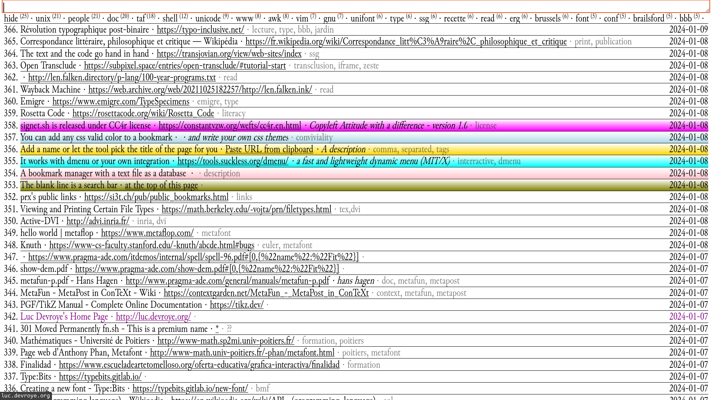

# Demo

**Quelque chose de plus lisible ici bientôt**

# Presentation
## signet.sh
Signet.sh est un script shell qui transforme une base de donnée de liens
en une page web. La conversion est faite par une commande awk au sein
d'une déclaration here-doc qui est redirigé dans une page html.

J'ai créé ce script car je trouve le gestionnaire de marque-page de
firefox insatisfaisant, autant dans sa forme que dans le format utilisé
(sqlite). Ce script et les utilitaires autours proposent une une
alternative pour archiver ses navigations internet.

## Format de la base de donné
Seule une Url est requise, le reste des champs sont
facultatifs, on compte les champs suivants :
* URL : ...
* Name : Par défaut la balise </title> de la page
* Description : ...
* Tags : mots-clés séparés d'une virgule
* Date : heure posix de l'ajout du lien
* Color : couleur css (nom, hex, rgb etc...)

Par exemple, dans un fichier qui s'appelle par défaut BOOKMARKS :
```
URL: https://rosettacode.org/wiki/Rosetta_Code
Name: Rosetta Code
Description: 
Tags: literacy, read
Date: 1704675057
Color: Purple

URL: https://www.emigre.com/TypeSpecimens
Name: Emigre: Type Specimens
Description: 
Tags: emigre, type
Date: 1704680644

URL: https://web.archive.org/web/20211025182257/http://len.falken.ink/
Name: Wayback Machine
Description: 
Tags: read
Date: 1704712747
```


# Autres gestionnaires de marque-pages :
- nb https://xwmx.github.io/nb/ (AGPL-3.0)
- ??


# Dependance~~s~~ :
Pour ajouter un lien via l'interface proposée, on aura besoin
d'installer dmenu ~~et htmlq~~.
* dmenu https://tools.suckless.org/dmenu/ (MIT/X)
* ~~htmlq https://github.com/mgdm/htmlq (MIT)~~ remplacé par une
  commande awk
## dmenu
Dmenu est un menu interactif qui permet de sélectionner et d'écrire des
valeurs dans un menu. Ces valeurs peuvent provenir d'un programme
fournit en entrée un *pipe* "|", par exemple :
```
ls | dmenu
```
affiche un menu déroulant avec les fichiers de mon répertoire. Dans
notre script, pour stocker le choix dans une variable, on peut faire :
```
tags=$(echo "" | dmenu -p "Enter comma-separated tags:")
```
## ~~htmlq~~
Htmlq est un parseur d'html écrit en go. Peu importe quel parseur on
utilise, on dirait que chaque langage a le sien.
Il s'agit ici de fournir au programme une chaîne de caractère en entrée
et d'en filtrer des éléments html
Si en javascript pour récupérer tous les \<h1> enfants d'une \<section> on
peut faire 
```
document.querySelectorAll('section h1')
```
En shell, c'est plus compliqué, htmlq est fait pour ça :
```
cat fichier.html | htmlq 'section h1'
```
Et pour récurer seulement le texte -- l'équivalent en javascript de
.innerHTML :
```
cat fichier.html | htmlq 'section h1' --text
```
On s'en sert pour récupérer la balise titre de la page à ajouter :
```
curl page.html | htmlq 'title' --text
```
Patch pré-sortie :
```
curl $url | awk -v RS='</title>' \
    '/<title>/ {gsub(/.*<title>/, ""); print}' |\
    tr -d '\n'
```

Pour l'instant cette étape est bloquante. Pour peu que la connection
internet coupe lors de l'ajout d'un lien, il faudra attendre la fin de
la tentative de curl pour passer au prochain champs du script :/ sorry !

# Usage : 
Pour ajouter un lien, je séléctionne l'url de la page avec Ctrl + l, la
copie et lance add.sh avec Super + i. _Si quelqu'un sait récupérer l'url
de la page courante du navigateur sans avoir à la copier, ça
économiserait deux étapes._
En résumé : Ctrl + l, Ctrl + c, Super + i
(ou plus court : Ctrl + l + i, Super + i)

Super + i car dans le fichier de configuration de mon gestionnaire de
fenêtre situé dans ~/.config/awesome/rc.lua j'ai les lignes suivantes :
```
awful.key({modkey}, "i", function()
awful.util.spawn_with_shell("add.sh") end, 
{description = "Enregistre le lien copié dans signet.sh"}),
```

# Structure du répertoire

* BOOKMARKS   → Une base de donnée de liens 
* add.sh      → Un script pour rajouter un lien dans la base de donné
  * dmenu
  * ./signet.sh
* signet.sh   → Le script shell en lui-même 
  * Il génère une nouvelle page html à partir de la base
    de donnés de liens (par défaut index.html)
* style.css   → La feuille de style pour styliser index.html
* script.js   → Un peu de javascript pour:
  * rechercher dans la \<textarea>
  * ajouter les couleurs de fond aux entrées qui en ont
  * si le champs de description est vide, ne pas
                   l'afficher
  * formater les dates du temps posix au format AA-MM-JJ
/!\ Prochainement /!\
starred.sh  → Un curl des repos de l'api github
https://api.github.com/users/[user]/starred , formaté de json à une
liste html sans jq !

# Crédits 
Junicode (OFL-1.1)
https://psb1558.github.io/Junicode-font/
Dmenu License (MIT/X) 
https://tools.suckless.org/dmenu/

